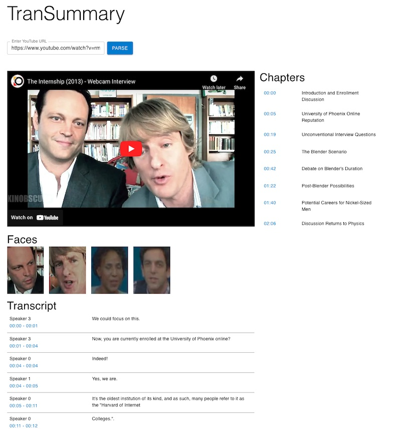

# TranSummary

## Description
TranSummary is a web application designed to enhance the accessibility and comprehension of YouTube videos. It features a React frontend and a Flask API backend. Users can input a YouTube video URL into the frontend, which then interacts with the backend to perform a series of operations. The API downloads the video, transcribes it using the Whisper AI with accurate timestamps, and finally, summarizes the content into well-defined chapters with titles, leveraging the OpenAI API.

## Features
- **React Frontend**: An interface for submitting YouTube video URLs and viewing chapter summaries.
- **Flask API Backend**: Handles video processing and transcription.
- **Video Transcription**: Utilizes Whisper AI for precise transcription with timestamps.
- **Content Summarization**: Implements OpenAI API to create concise, titled chapters for easy navigation and understanding of the video content.

## References
- https://github.com/MahmoudAshraf97/whisper-diarization
- https://github.com/cppxaxa/FaceRecognitionPipeline_GeeksForGeeks

